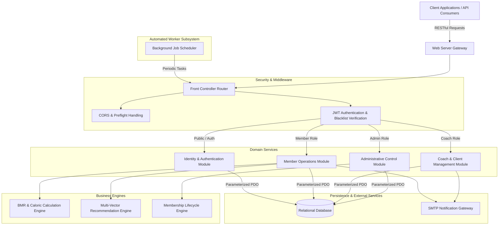
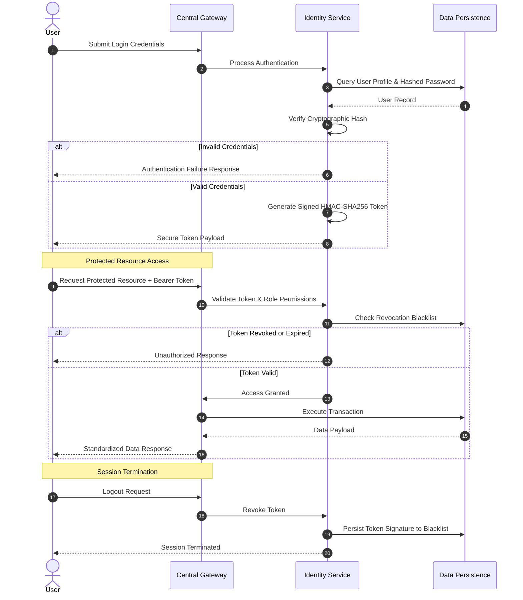

# ⚡ Olympus Gym Management System - Core Backend Engine & Architecture

[](https://www.php.net/)
[](https://www.mysql.com/)
[](https://nodejs.org/)
[](https://jwt.io/)
[](https://www.php.net/manual/en/book.pdo.php)
[](LICENSE)

> A high-performance, enterprise-grade server-side architecture powering gym management operations, client-coach relations, background scheduling, health calculation algorithms, and intelligent fitness recommendation services.

---

## 📌 Repository Summary (For GitHub Description)

```text
High-performance PHP 8 RESTful API & Management System for gym operations featuring Role-Based Access Control (RBAC), custom HMAC-SHA256 JWT auth with state-persisted token blacklisting, Harris-Benedict BMR/TDEE nutrition calculation engine, multi-factor recommendation system, automated background notifications, and PDO transactional database safety.
```

---

## 📋 Executive Summary & Portfolio Overview

The **Olympus Gym Management System** is a robust backend engine engineered to streamline complex fitness center operations. Designed around a lightweight Model-View-Controller (MVC) architectural pattern, the platform provides secure RESTful communication, strict Role-Based Access Control (RBAC), transactional database reliability, and automated health analytics.

### 🌟 Core Capabilities
- **Role-Based Access Control (RBAC)**: Enforces distinct access boundaries and operational permissions for Administrators, Coaches, and Members.
- **Token Security & Revocation Layer**: Implements a custom HMAC-SHA256 JWT architecture coupled with persistent token blacklisting for immediate server-side revocation upon session termination.
- **Biometric & Nutritional Calculation Engine**: Computes sex-adjusted Basal Metabolic Rates (BMR) using the Harris-Benedict equation, Total Daily Energy Expenditure (TDEE) based on activity multipliers, target caloric adjustments, and macronutrient yields.
- **Multi-Attribute Recommendation Service**: Uses profile-matching logic (evaluating physical activity, body composition, age bracket, fitness targets, and experience) to recommend personalized training and nutrition regimes.
- **Asynchronous Lifecycle Scheduler**: Automated background service handling notification dispatch for membership expiry alerts, visit scheduling, and session reminders over encrypted email protocols.
- **ACID-Compliant Data Processing**: Enforces atomic transactions across multi-entity data workflows to guarantee consistency and eliminate partial state corruption.

---

## 📐 System Architecture & Data Flow

### 1. High-Level System Architecture



---

### 2. Authentication & Session Revocation Flow



---

### 3. Recommendation Engine Workflow


---

## 🧠 Core Engineering & System Design

### 1. Unified Front Controller Pattern
The backend employs a lightweight front controller design pattern that centralizes request routing, request sanitization, and global exception handling. All inbound network traffic is routed through a single entry point that dynamically dispatches requests to the appropriate domain service based on HTTP verb semantics and validated authorization scopes.

### 2. Hybrid Stateless Token Security with Persistent Revocation
To maintain the performance advantages of stateless token authentication while fulfilling enterprise security requirements, the architecture incorporates a hybrid revocation system:
- Access tokens are cryptographically signed using HMAC-SHA256 and contain embedded expiry constraints and unique identifiers.
- Upon explicit logout, token signatures are stored in a persistent database blacklist store.
- Protected route middleware cross-references incoming tokens against the revocation store, ensuring immediate session termination without invalidating active non-revoked sessions.

### 3. Transactional Integrity & State Safety
Complex business operations—such as multi-entity user registration—require strict atomic guarantees. The data layer utilizes explicit database transaction blocks:
- Transaction boundary is established prior to writing primary identity records.
- Associated biometric profiles, medical preferences, and subscription metadata are written sequentially.
- In the event of any operation failure, the transaction is automatically rolled back, returning the database to a known valid state and preventing orphaned records.

---

## 🧮 Algorithmic & Mathematical Foundations

### 1. Basal Metabolic Rate (BMR) & Caloric Expenditure Engine
The health calculation service implements the **Harris-Benedict Equation** tailored to biological sex characteristics:

$$\text{BMR}_{\text{Male}} = 66 + (6.2 \times \text{weight}_{\text{lbs}}) + (13.7 \times \text{height}_{\text{cm}}) - (6.8 \times \text{age}_{\text{years}})$$

$$\text{BMR}_{\text{Female}} = 655 + (4.35 \times \text{weight}_{\text{lbs}}) + (4.7 \times \text{height}_{\text{cm}}) - (4.7 \times \text{age}_{\text{years}})$$

#### Total Daily Energy Expenditure (TDEE) Multipliers:
- **Sedentary**: $\text{TDEE} = \text{BMR} \times 1.2$
- **Lightly Active**: $\text{TDEE} = \text{BMR} \times 1.375$
- **Moderately Active**: $\text{TDEE} = \text{BMR} \times 1.55$
- **Very Active**: $\text{TDEE} = \text{BMR} \times 1.725$
- **Extra Active**: $\text{TDEE} = \text{BMR} \times 1.9$

#### Target Caloric Adjustments:
- **Weight Loss Objective**: $\text{Target Calories} = \text{TDEE} - 500\text{ kcal/day}$
- **Weight Gain Objective**: $\text{Target Calories} = \text{TDEE} + 500\text{ kcal/day}$
- **Maintenance Objective**: $\text{Target Calories} = \text{TDEE}$

#### Macronutrient Yield Formulation:
$$\text{Total Caloric Yield} = (\text{Protein}_{\text{grams}} \times 4) + (\text{Carbohydrates}_{\text{grams}} \times 4) + (\text{Fats}_{\text{grams}} \times 9)$$

---

### 2. Multi-Attribute Recommendation Scoring
The recommendation engine evaluates client compatibility against pre-established fitness regimens by computing an aggregate match score ($S$) across five normalized profile vectors:

$$S = \sum_{i=1}^{5} w_i \cdot \delta(U_i, R_i)$$

Where $U_i$ represents the user attribute, $R_i$ represents the regime requirement, $w_i$ is the vector weight, and $\delta$ is an indicator function returning $1$ upon exact match and $0$ otherwise. Regimens are ordered by descending compatibility score to deliver optimal personalized plans.

---

## 🤖 Automated Background Processing Pipeline

The platform integrates an automated background scheduling service designed for continuous operational maintenance and asynchronous task execution:

- **Lifecycle Expiration Monitoring**: Scans membership state boundaries and triggers proactive notification alerts prior to plan expiration.
- **Session & Schedule Reminders**: Automated dual-party dispatching scheduled reminders to both clients and assigned coaches prior to confirmed sessions.
- **Visit Scheduling Notifications**: Processes member-configured training schedules to send timely visit reminders.
- **Automated Subscription Status Synchronizer**: Evaluates expired memberships on milestone dates and updates operational access status.

---

## 🗄️ Relational Data Architecture (Conceptual Model)

The database schema is organized into modular conceptual data domains to enforce separation of concerns and maintain relational integrity:

- **Identity & Access Management Domain**: Stores user credentials, authentication parameters, role assignments, and token revocation registries.
- **Biometrics & Physical Health Domain**: Manages member physical metrics, height/weight histories, body composition classifications, activity levels, and medical condition associations.
- **Subscription & Billing Lifecycle Domain**: Tracks active membership tiers, duration constraints, subscription start/expiry milestones, and payment states.
- **Coaching & Roster Domain**: Manages coach profiles, specialization details, client-coach class pairings, and direct communication logs.
- **Scheduling & Reminders Domain**: Handles gym visit alarm preferences and scheduled 1-on-1 coaching sessions.
- **Knowledge & Recommendation Dataset Domain**: Contains curated workout plans, nutritional guidelines, and classification vectors for the recommendation engine.

---

## 🔒 Security Architecture & Vulnerability Mitigation

Security controls are embedded throughout the application layer:

- 🛡️ **Parameterized Data Access**: All database queries utilize PDO prepared statements with strict parameter binding, shielding the system against SQL Injection (SQLi) attacks.
- 🔑 **Cryptographic Password Protection**: User credentials are protected using standard BCrypt password hashing algorithms. Plaintext credentials are never persisted or exposed in execution logs.
- 🚫 **Session Revocation Guard**: Token blacklisting prevents replay attacks following user logout by maintaining a server-side record of revoked signatures.
- 🔐 **Environment Configuration Security**: Critical system secrets, database connection parameters, and mailer credentials are managed via environment files excluded from public version control.
- 🌐 **Access Control & CORS Isolation**: Dynamic CORS policies restrict resource access to authorized origins and enforce proper HTTP method scoping.
- 🧹 **Context-Aware Output Sanitization**: User-supplied input is sanitized to protect against Cross-Site Scripting (XSS) vectors across notification templates.

---

## 💻 Local Installation & Setup Guide

### 1. Prerequisites
- **PHP**: Version 8.1+ (with `pdo_mysql` and `openssl` extensions enabled)
- **Web Server**: Apache Server (with `mod_rewrite` module enabled)
- **Database Engine**: MySQL Server 8.0+ / MariaDB
- **Node.js**: Node.js v18+ & `npm`
- **Composer**: PHP Dependency Manager

---

### 2. Environment Configuration Setup

Create an environment configuration file (`.env`) in the backend root directory using the template below:

```env
# Database Configuration
SERVER=127.0.0.1
DBASE=your_database_name
USER=your_db_username
PASSWORD=your_db_password

# Authentication Credentials
SECRET_KEY=your_jwt_hmac_sha256_secret_key

# Mailer Credentials
googleSMTPpassword=your_smtp_app_password
```

---

### 3. Dependency Installation

1. **PHP Packages**:
   ```bash
   cd Backend
   composer install
   ```

2. **Background Task Packages**:
   ```bash
   cd Backend
   npm install
   ```

---

### 4. Application Execution

1. **Web Server Host**: Configure Apache to point to the backend application root directory with `mod_rewrite` enabled.
2. **Background Scheduler**: Launch the background worker script to process scheduled email tasks:
   ```bash
   cd Backend
   npm start
   ```

---

## 📝 Portfolio Author Note

Engineered as a comprehensive backend architecture project demonstrating proficiency in object-oriented PHP 8 design, custom authentication protocols, mathematical calculation services, database transaction security, and automated background job processing.

---
*Built with precision for Olympus Gym Management System.*
