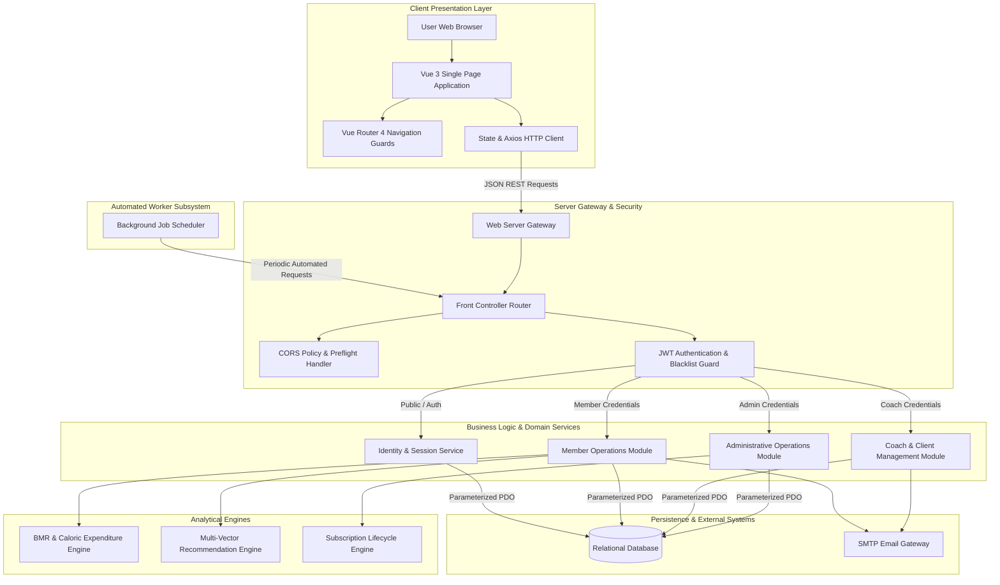
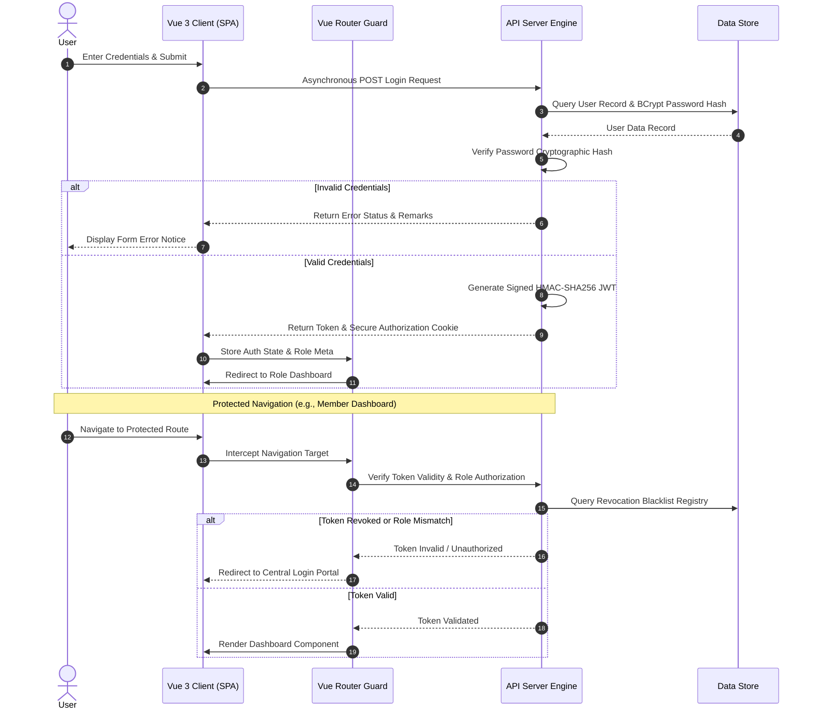
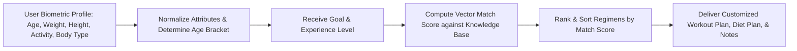

# ⚡ Olympus Gym Management System - Full-Stack Architecture & Platform

[](https://vuejs.org/)
[](https://vitejs.dev/)
[](https://www.php.net/)
[](https://www.mysql.com/)
[](https://nodejs.org/)
[](https://jwt.io/)
[](LICENSE)

> A full-stack, enterprise-grade gym management platform featuring a responsive Vue 3 Single Page Application (SPA), high-throughput PHP 8 RESTful API engine, automated background scheduler, biometric nutritional algorithms, and multi-vector fitness recommendation services.

---

## 📌 Repository Summary (For GitHub Description)

```text
Full-stack Vue 3 & PHP 8 Gym Management System featuring Role-Based Access Control (RBAC), custom HMAC-SHA256 JWT auth with state-persisted token blacklisting, Harris-Benedict BMR/TDEE nutrition calculation engine, multi-factor recommendation system, automated background notifications, and PDO transactional database safety.
```

---

## 📋 Executive Summary & Portfolio Overview

The **Olympus Gym Management System** is a complete end-to-end software platform designed to digitize fitness center operations, member management, trainer client rosters, nutritional tracking, and scheduled communication.

Architected with a decoupled full-stack design, the system pairs an intuitive **Vue 3 Single Page Application** with a high-performance **PHP 8 RESTful API engine** backed by a relational database and an automated asynchronous background scheduler.

### 🌟 Core Capabilities
- **Decoupled Full-Stack Architecture**: Modern Vue 3 SPA client communicating asynchronously via RESTful HTTP calls to a lightweight, custom MVC server engine.
- **Client & Server Role-Based Access Control (RBAC)**: Unified security model enforcing client-side navigation routing guards and server-side permission checks across Administrators, Coaches, and Members.
- **Hybrid Token Security & Revocation**: Cryptographic HMAC-SHA256 JWT authentication supported by a persistent database revocation blacklist for immediate session invalidation upon logout.
- **Biometric & Nutritional Analytics Engine**: Automated Basal Metabolic Rate (BMR) calculations using the sex-specific Harris-Benedict equation, Total Daily Energy Expenditure (TDEE) multipliers, goal-oriented caloric adjustments, and macronutrient yields.
- **Multi-Attribute Recommendation Engine**: Automated profile matching that evaluates physical metrics, body composition, activity levels, and fitness goals to recommend tailored workout and diet plans.
- **Role-Dedicated Web Consoles**: Tailored dashboards for Members (health tracking, alarms, coach booking, class enrollment), Coaches (client rosters, metric inspection, direct emailing), and Admins (member CRUD, subscription management, medical registries).
- **Asynchronous Lifecycle Scheduler**: Background worker automated for membership expiration warnings, session schedule alerts, and daily visit notifications via SMTP.

---

## 📐 System Architecture & Data Flow

### 1. Full-Stack End-to-End Architecture



---

### 2. Full-Stack Authentication & Route Guarding Flow



---

### 3. Recommendation Engine Data Pipeline



---

## 💻 Frontend Client Architecture & Feature Suite

The user interface is structured as a modern Single Page Application (SPA) built with **Vue 3** and compiled via **Vite**. It leverages **Vue Router 4** for role-gated navigation, **Axios** for asynchronous network requests, **FontAwesome 6** for responsive iconography, and **Moment.js** for timestamp formatting.

### 🌐 1. Public Information Portal
- **Landing Gateway**: Responsive homepage presenting facility highlights, fitness programs, and calls-to-action.
- **Informational Pages**: Specialized views detailing company background, service catalog, coaching staff bios, and contact forms.
- **Central Authentication Hub**: Unified login interface routing users to dedicated portal gateways based on user type.

### 👤 2. Member Interactive Suite
- **Personalized Health Dashboard**: Real-time overview of current membership status, scheduled gym visits, booked coaching sessions, and daily caloric metrics.
- **Biometric Profile Manager**: Interface for updating physical statistics (height, weight, body type, activity level) with instant body mass index (BMI) calculation feedback.
- **Caloric & Nutrition Workspace**: Interactive calculator computing Basal Metabolic Rate (BMR), Total Daily Energy Expenditure (TDEE), and daily macro targets based on fitness goals.
- **Fitness Plan Recommendation Interface**: Interactive wizard capturing user preferences and presenting tailored workout and diet plans.
- **Coach Directory & Class Enrollment**: View available coach qualifications, enroll in training classes, manage class enrollments, and set workout alarm schedules.

### 🏋️ 3. Coach Management Portal
- **Client Roster Console**: View list of assigned active clients with direct access to client physical measurements and fitness progress.
- **Direct Client Messaging**: Interface allowing coaches to dispatch direct email updates and training instructions to assigned clients.
- **Coach Profile Workspace**: Maintain personal biographical data, contact details, physical metrics, and coaching qualifications.

### 👑 4. Administrator Control Center
- **Member Directory Console**: Comprehensive data management view for searching, filtering, inspecting, and archiving member accounts.
- **Subscription & Payment Manager**: Monitor member subscription tiers, manage plan durations, and manually verify payment activations.
- **Special Conditions Registry**: Track member medical conditions and physical restrictions for personalized safety monitoring.
- **Staff Directory**: Register new coach profiles and maintain administrative staff accounts.

---

## 🧠 Backend Engineering & System Architecture

### 1. Unified REST Front Controller Router
The server handles request routing through a high-efficiency front controller pattern. Request paths are processed through server rewrite configuration into a central dispatcher that maps HTTP verbs (`GET`, `POST`, `PUT`, `DELETE`) to target domain models while enforcing global CORS headers and error boundary catches.

### 2. Hybrid JWT Security with State-Persisted Revocation
The API uses cryptographically signed `HS256` JSON Web Tokens containing user scope metadata, unique identifiers, and expiration dates. To allow immediate session termination upon logout, token signatures are stored in a persistent database blacklist store. Middleware queries this blacklist on every protected request to block revoked tokens instantly.

### 3. ACID-Compliant Transaction Integrity
Complex multi-entity actions—such as initializing member records alongside biometric details, subscription durations, and medical condition links—are wrapped in explicit database transactions. If any sub-operation fails, the transaction is automatically rolled back to prevent partial database state corruption.

---

## 🧮 Algorithmic & Mathematical Foundations

### 1. Basal Metabolic Rate (BMR) & Caloric Expenditure Engine
The health module evaluates user profile data using the sex-adjusted **Harris-Benedict Equation**:

$$\text{BMR}_{\text{Male}} = 66 + (6.2 \times \text{weight}_{\text{lbs}}) + (13.7 \times \text{height}_{\text{cm}}) - (6.8 \times \text{age}_{\text{years}})$$

$$\text{BMR}_{\text{Female}} = 655 + (4.35 \times \text{weight}_{\text{lbs}}) + (4.7 \times \text{height}_{\text{cm}}) - (4.7 \times \text{age}_{\text{years}})$$

#### Total Daily Energy Expenditure (TDEE) Multipliers:
- **Sedentary**: $\text{TDEE} = \text{BMR} \times 1.2$
- **Lightly Active**: $\text{TDEE} = \text{BMR} \times 1.375$
- **Moderately Active**: $\text{TDEE} = \text{BMR} \times 1.55$
- **Very Active**: $\text{TDEE} = \text{BMR} \times 1.725$
- **Extra Active**: $\text{TDEE} = \text{BMR} \times 1.9$

#### Caloric Target Adjustments:
- **Weight Loss Goal**: $\text{Target Calories} = \text{TDEE} - 500\text{ kcal/day}$
- **Weight Gain Goal**: $\text{Target Calories} = \text{TDEE} + 500\text{ kcal/day}$
- **Maintenance Goal**: $\text{Target Calories} = \text{TDEE}$

#### Macronutrient Yield Formulation:
$$\text{Total Caloric Yield} = (\text{Protein}_{\text{grams}} \times 4) + (\text{Carbohydrates}_{\text{grams}} \times 4) + (\text{Fats}_{\text{grams}} \times 9)$$

---

### 2. Multi-Attribute Recommendation Scoring
The recommendation algorithm computes a compatibility score ($S$) matching user profile attributes against candidate regimens across five normalized feature dimensions:

$$S = \sum_{i=1}^{5} w_i \cdot \delta(U_i, R_i)$$

Where $U_i$ represents the user attribute, $R_i$ represents the regimen requirement, $w_i$ is the vector weight, and $\delta$ returns $1$ upon exact match and $0$ otherwise. Regimens are ordered by descending compatibility score to output the highest-ranked fitness plan.

---

## 🤖 Automated Background Processing Pipeline

An asynchronous background scheduling service operates in tandem with the API server for automated operational tasks:

- **Subscription Lifecycle Expiry Monitoring**: Detects memberships nearing expiration dates and sends automated email notices.
- **Session & Schedule Reminders**: Sends scheduled dual-party reminder emails to both clients and coaches 24 hours prior to booked sessions.
- **Gym Visit Notifications**: Processes member visit alarm preferences to dispatch day-of training reminders.
- **Automated Subscription Status Synchronizer**: Evaluates expired memberships on milestone dates and updates system access status.

---

## 🗄️ Relational Data Architecture (Conceptual Model)

The database schema is organized into modular conceptual data domains to maintain relational separation of concerns:

- **Identity & Access Management Domain**: Manages account credentials, user roles, security flags, and token revocation registries.
- **Biometrics & Physical Health Domain**: Stores physical measurements, height/weight logs, body composition metrics, activity levels, and medical condition links.
- **Subscription & Financial Lifecycle Domain**: Manages subscription plans, duration rules, billing milestones, and plan activation statuses.
- **Coaching & Roster Domain**: Tracks coach qualifications, contact information, coach-client class assignments, and message logs.
- **Scheduling & Reminders Domain**: Stores gym visit alarm configurations and booked 1-on-1 coaching sessions.
- **Knowledge Base & Recommendation Domain**: Holds curated workout plans, nutritional guidelines, and classification vectors for recommendation matching.

---

## 🔒 Security Architecture & Vulnerability Mitigation

System-wide security principles protect application data across both frontend and backend layers:

- 🛡️ **Parameterized Data Access**: Database interactions use PDO prepared statements with strict parameter binding to eliminate SQL Injection (SQLi) risks.
- 🔑 **Cryptographic Password Protection**: Password credentials are hashed using standard BCrypt algorithms. Plaintext passwords are never logged or stored.
- 🚫 **Token Revocation Guard**: Token blacklisting prevents replay attacks following user logout by maintaining a server-side registry of revoked signatures.
- 🚦 **Client-Side & Server-Side Navigation Guards**: Dual-layer authorization checks prevent unauthorized route navigation on the client SPA and enforce endpoint permission checks on the API.
- 🔐 **Isolated Environment Secrets**: Sensitive database connection credentials, JWT keys, and SMTP credentials are stored in environment configurations excluded from version control.
- 🌐 **Strict CORS & Sanitization Policies**: Dynamic CORS policies restrict resource access to authorized origins, while output sanitization shields against Cross-Site Scripting (XSS) in notification templates.

---

## 💻 Full-Stack Installation & Setup Guide

### 1. Prerequisites
- **Node.js**: Version 18+ and `npm`
- **PHP**: Version 8.1+ (with `pdo_mysql` and `openssl` extensions enabled)
- **Web Server**: Apache Web Server (with `mod_rewrite` enabled)
- **Database Engine**: MySQL Server 8.0+ / MariaDB
- **Composer**: PHP Dependency Manager

---

### 2. Frontend Setup (Vue 3 Client)

1. **Navigate to Frontend Directory**:
   ```bash
   cd Frontend
   ```

2. **Install Node Dependencies**:
   ```bash
   npm install
   ```

3. **Launch Development Server**:
   ```bash
   npm run dev
   ```

4. **Build for Production**:
   ```bash
   npm run build
   ```

---

### 3. Backend Setup (PHP 8 Server Engine)

1. **Configure Environment File**:
   Create a `.env` file in `./Backend` using the template below:
   ```env
   # Database Credentials
   SERVER=127.0.0.1
   DBASE=your_database_name
   USER=your_db_username
   PASSWORD=your_db_password

   # JWT Auth Secret
   SECRET_KEY=your_jwt_hmac_sha256_secret_key

   # SMTP Credentials
   googleSMTPpassword=your_smtp_app_password
   ```

2. **Install PHP Dependencies**:
   ```bash
   cd Backend
   composer install
   ```

3. **Install Task Runner Dependencies**:
   ```bash
   cd Backend
   npm install
   ```

4. **Run Background Worker**:
   ```bash
   cd Backend
   npm start
   ```

---

## 📝 Portfolio Author Note

Developed as an end-to-end full-stack software project showcasing expertise in Vue 3 Single Page Application design, object-oriented PHP 8 REST API development, cryptographic security implementation, health calculation algorithms, relational database architecture, and automated background job scheduling.

---
*Built with precision for Olympus Gym Management System.*
